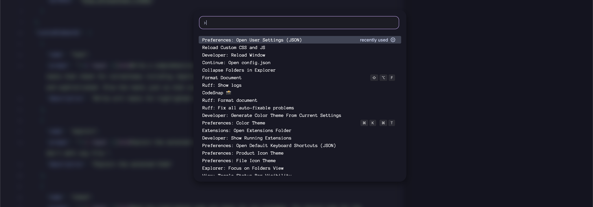

# Visual Studio Code Customization

## Objective
Customize Visual Studio Code and remove all the unnecessary features.

## Using
1. Install the  [Custom CSS and JS Loader](https://marketplace.visualstudio.com/items?itemName=be5invis.vscode-custom-css) extension from the marketplace.
2. Enable the extesion by pressing `ctrl+shift+p` for windows and linux or `cmd+shift+p` for mac.
3. Type `Enable Custom CSS and JS` in the search box and and press enter
4. Edit your `settings.json`. and add the following

 ```json
//Replace username with your username and Path_to_this_Repository with the path of this repository.
    "vscode_custom_css.imports": [
        //macos or linux
    "file:///Users/username/Path_to_this_Repository/custom.css",
    "file:///Users/username/Path_to_this_Repository/custom.js"
    //Windows
    "file:///C:/Users/username/Path_to_this_Repository/custom.css",
    "file:///C:/Users/username/Path_to_this_Repository/custom.js"

    ],
```
5. Press `ctrl+shift+p` for windows and linux or `cmd+shift+p` for mac.
6. Type `Reload Custom CCS and JS` in the search box and press enter and press `Enter`.

## Screenshots


